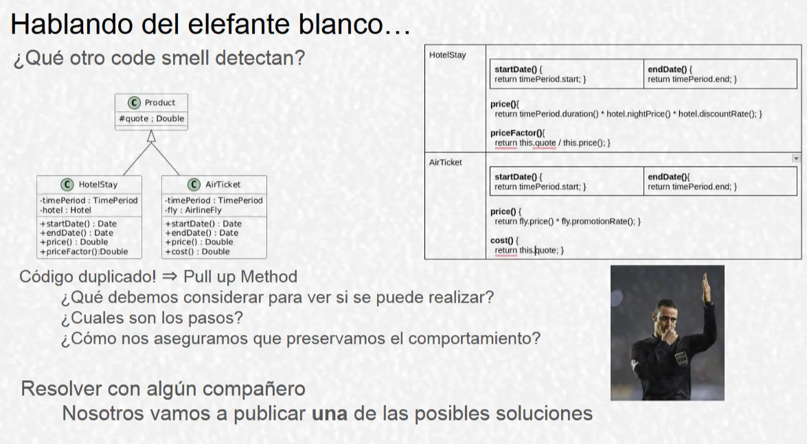
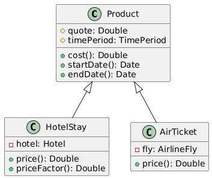

# Ejemplo de código para refactorear

---



## Paso uno: Análisis

---

- Lo primero que noto es que ambas subclases tienen dos funciones *startDate()* y *endDate()* que se repiten tal cual. Este es un caso de **Duplicated Code** (Código Répetido)
- Pero no es el único caso, porque también veo que las dos clases también poseen una variable *timePeriod*, y cada variable tiene el mismo modificador de acceso (están puestas en privado), osea de nuevo **Código Repetido**
- Profundizando un poco más en el código, también puedo divisar un fragmento de código candidato para ser extraido y refactorizado en las funciones *priceFactor()* y *cost()*. Las dos funciones comparten un acceso a la variable *quote*, que se encuentra en la superclase. Pero no están escritas de la misma forma, si no que la primera divide el valor de esta variable por el que obtenga al invocar *precio()*, mientras que la otra simple y llanamente devuelve el valor de *quote*. Lo que podríamos hacer entonces es extraer la parte que es común a ambas funciones. Otra vez **Código Repetido**.
- Después lo último que quedaría, que ya es mas bien opcional, porque en realidad depende del uso que tenga la clase Producto y si se van a crear mas clases hijas de Product o no, es crear un método/funcion abstracto para price() en la superclase, y definirla/overridearla en cada subclase, favoreciendo así el polimorfismo. (No se bién que sería esto lmao)

## Paso dos: Refactoring

---

1. Quitar de las clases *HotelStay* y *AirTicket* las funciones *startDate()* y *endDate()*
2. Pegar las funciones borradas en la clase *Product* —> **Pull Up Method**
3. Quitar de las clases *HotelStay* y *AirTicket* la variable timePeriod
4. Pegar la variable borrada en la clase *Product (*y cambiar su mod. de acceso a protegido*)*—> **Pull Up Field**
5. Quitar de la clase AirTicket la función *cost()*
6. Pegar la función borrada en la clase *Product* —> **Pull Up Method**
7. Cambiar el nombre de la función *cost()* a *quote()* —> **Rename Field**
8. Modificar el código de la función *priceFactor()* a “`return this.quote() / this.price()`” —> **Replace Inline Code with Function Call**

## Resultado final

---



### Código de la clase *Product*

```java
quote() {
	return this.quote;
}

startDate() {
	return this.timePeriod.start;
}

endDate() {
	return this.timePeriod.end;
}
```

### Código de la clase *HotelStay*

```java
price() {
	return this.timePeriod.duration * this.hotel.nightPrice * this.hotel.discountRate();
}

priceFactor() {
	return this.quote() / this.price();
}
```

### Código de la clase *AirTicket*

```java
price() {
	return this.fly.ticket() / this.fly.promotionRate();
}

priceFactor() {
	return this.quote() / this.price();
}
```